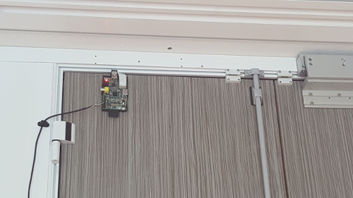
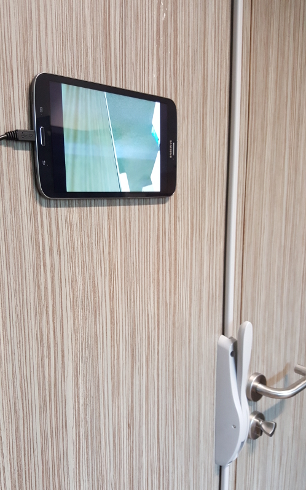
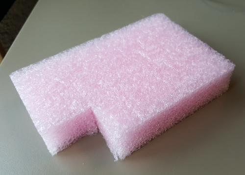
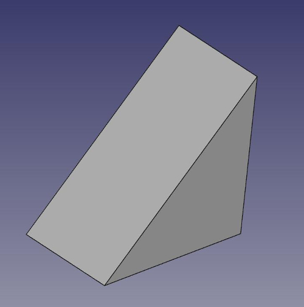

## Raspberry PI spy camera

Stream from a Raspberry PI camera module to Android RTSP client

### Features 

* Raspberry PI
* camera module
* Android tablet
* TTL cable
* SD card
* scissors
* double-sided self-adhesive
* 2 alimentation (for Raspberry & Tablet)
* USB A cable male-female

### Overview



Raspberry PI located on the door (not the opening side)<br/>
Note : I had some issues with alim cable so I used TTL cable instead
<hr/>


### Hardware/Network setup

* install raspbian on your raspberry PI 

* connect on raspberry via TTL cable

* plug wifi dongle in your raspberry 

* edit wpa_supplicant configuration file : 

```
sudo vi /etc/wpa_supplicant/wpa_supplicant.conf
```

Modify according to your Wifi configuration : 

```
country=GB
ctrl_interface=DIR=/var/run/wpa_supplicant GROUP=netdev
update_config=1
network={
	ssid="YOUR_SSID"
	psk="password"
}
```

### Administration setup

```
sudo apt-get update
sudo apt-get upgrade
```

* enable camera interface

```
sudo raspi-config => camera => enable => reboot
```

* get last firmware

```
sudo rpi-update
```

### Build V4L2

* install some packages needed to build it

```
sudo apt-get install autoconf gettext libtool autoconf
```

* install `libjpeg62-dev` not included in raspbian jessie :

 * add `deb http://mirrordirector.raspbian.org/raspbian/ wheezy main contrib non-free rpi` to `/etc/apt/sources.list`
 * `sudo apt-get update`
 * `sudo apt-get install libjpeg62 libjpeg62-dev`
 * remove `deb http://mirrordirector.raspbian.org/raspbian/ wheezy main contrib non-free rpi` from `/etc/apt/sources.list`
 * `sudo apt-get update`


* Get the source code for the V4L utilities

```
git clone git://git.linuxtv.org/v4l-utils.git
cd v4l-utils
./bootstrap.sh
./configure
make
sudo make install
```

* load `bcm2835-v4l2` kernel module

```
sudo modprobe bcm2835-v4l2
```

### Build RTSP server

I used <a href="https://github.com/mpromonet/v4l2rtspserver">v4l2rtspserver project</a> for RTSP server because it provides much smaller latency than `raspivid` and `cvlc`.

* install cmake

```
sudo apt-get install cmake
```

* clone/build/install

```
git clone git@github.com:mpromonet/v4l2rtspserver.git
cmake . && make
sudo make install
```

* launch rtsp server (default of 640*480 with 25fps)
```
h264_v4l2_rtspserver
```

### Persistent RTSP server

In order to have a persistent service running at boot copy `video` init.d script to `/etc/init.d/` and `video.sh` to `/bin/`

```
chmod 777 video
chmod 777 video.sh

cp video /etc/init.d/
cp video.sh /bin/
```

* install persitent service :

```
update-rc.d video defaults
```

* start / stop / restart camera service usage

```
# start service 
service video start

# stop service
service video stop

# restart service
service video restart
```

video service is now automatically launching at boot

### Disable camera led

add `disable_camera_led=1` to `/boot/config.txt`

### Add V4L2 module at boot

```
vi /etc/modules
# add a new line with : bcm2835-v4l2
```

### Flip video

If necessary :

```
v4l2-ctl --set-ctrl vertical_flip=1
```

### RTSP client

I used an old Android tablet with an RTSP client app such as <a href="https://play.google.com/store/apps/details?id=org.rtspplr.app&hl=en">this one</a> or <a href="https://play.google.com/store/apps/details?id=veg.network.mediaplayer&hl=en">this one</a>.



### Camera module support

I used some cut of safety foam to use for the camera module support :



You can also print your own module support on a 3D printer with the supplied model `support_camera.obj` or remodeling it on FreeCAD editing `support_camera.fcstd` :



### external links 

* http://www.ics.com/blog/raspberry-pi-camera-module#.VJFhbyvF-b8

### Alternative to v4l2rtspserver

* raspivid

```
raspivid -o - -t 0 -n -w 640 -h 480 -fps 25 | cvlc -vvv stream:///dev/stdin --sout '#rtp{sdp=rtsp://:8554/}' :demux=h264
```

* cvlc

```
cvlc --no-audio v4l2:///dev/video0 --v4l2-width 640 --v4l2-height 480 --v4l2-chroma MJPG --v4l2-hflip 1 --v4l2-vflip 1 --sout '#standard{access=http{mime=multipart/x-mixed-replace;boundary=--7b3cc56e5f51db803f790dad720ed50a},mux=mpjpeg,dst=:8554/}' -I dummy
```

### Note

I used the included 150mm ribbon cable of the camera module, but if you need more length, you can buy a 300mm cable from a reseller.